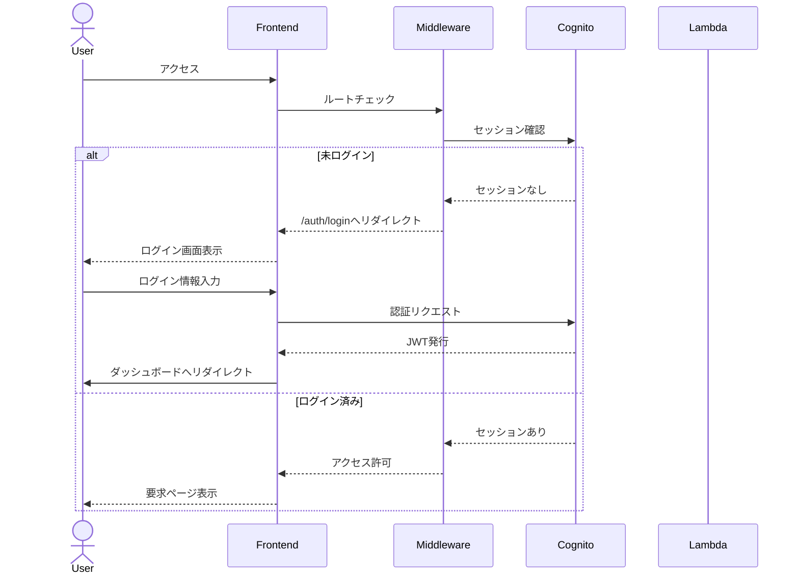
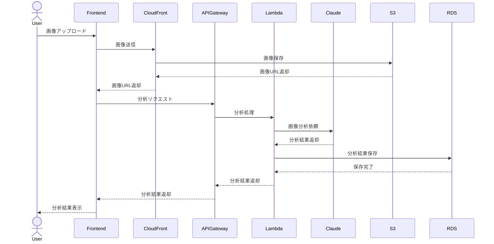
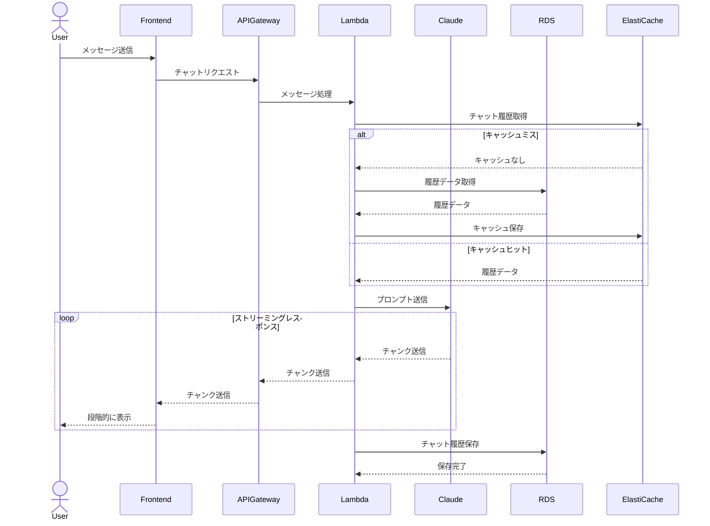
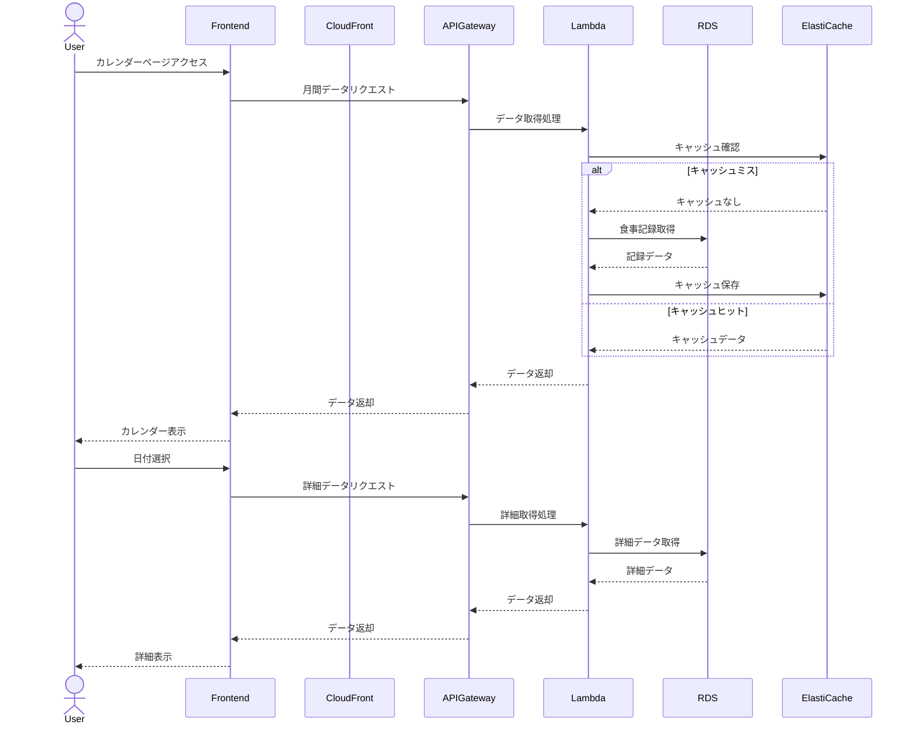
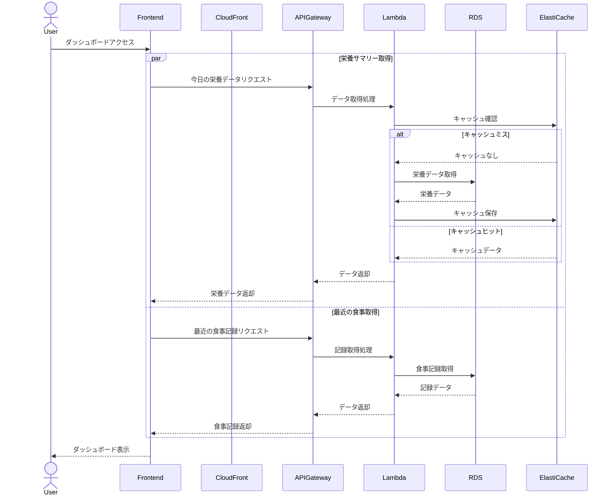

# AWS移行後のシーケンス図

## 認証フロー

```mermaid
sequenceDiagram
    actor User
    participant Frontend
    participant Middleware
    participant Cognito
    participant Lambda
    
    User->>Frontend: アクセス
    Frontend->>Middleware: ルートチェック
    Middleware->>Cognito: セッション確認
    
    alt 未ログイン
        Cognito-->>Middleware: セッションなし
        Middleware-->>Frontend: /auth/loginへリダイレクト
        Frontend-->>User: ログイン画面表示
        User->>Frontend: ログイン情報入力
        Frontend->>Cognito: 認証リクエスト
        Cognito-->>Frontend: JWT発行
        Frontend->>User: ダッシュボードへリダイレクト
    else ログイン済み
        Cognito-->>Middleware: セッションあり
        Middleware-->>Frontend: アクセス許可
        Frontend-->>User: 要求ページ表示
    end
```

## 食事分析フロー

```mermaid
sequenceDiagram
    actor User
    participant Frontend
    participant CloudFront
    participant APIGateway
    participant Lambda
    participant Claude
    participant S3
    participant RDS
    
    User->>Frontend: 画像アップロード
    Frontend->>CloudFront: 画像送信
    CloudFront->>S3: 画像保存
    S3-->>CloudFront: 画像URL返却
    CloudFront-->>Frontend: 画像URL返却
    
    Frontend->>APIGateway: 分析リクエスト
    APIGateway->>Lambda: 分析処理
    Lambda->>Claude: 画像分析依頼
    Claude-->>Lambda: 分析結果返却
    Lambda->>RDS: 分析結果保存
    RDS-->>Lambda: 保存完了
    Lambda-->>APIGateway: 分析結果返却
    APIGateway-->>Frontend: 分析結果返却
    Frontend-->>User: 分析結果表示
```

## AIアシスタントチャットフロー

```mermaid
sequenceDiagram
    actor User
    participant Frontend
    participant APIGateway
    participant Lambda
    participant Claude
    participant RDS
    participant ElastiCache
    
    User->>Frontend: メッセージ送信
    Frontend->>APIGateway: チャットリクエスト
    APIGateway->>Lambda: メッセージ処理
    
    Lambda->>ElastiCache: チャット履歴取得
    alt キャッシュミス
        ElastiCache-->>Lambda: キャッシュなし
        Lambda->>RDS: 履歴データ取得
        RDS-->>Lambda: 履歴データ
        Lambda->>ElastiCache: キャッシュ保存
    else キャッシュヒット
        ElastiCache-->>Lambda: 履歴データ
    end
    
    Lambda->>Claude: プロンプト送信
    
    loop ストリーミングレスポンス
        Claude-->>Lambda: チャンク送信
        Lambda-->>APIGateway: チャンク送信
        APIGateway-->>Frontend: チャンク送信
        Frontend-->>User: 段階的に表示
    end
    
    Lambda->>RDS: チャット履歴保存
    RDS-->>Lambda: 保存完了
```

## カレンダー表示フロー

```mermaid
sequenceDiagram
    actor User
    participant Frontend
    participant CloudFront
    participant APIGateway
    participant Lambda
    participant RDS
    participant ElastiCache
    
    User->>Frontend: カレンダーページアクセス
    Frontend->>APIGateway: 月間データリクエスト
    APIGateway->>Lambda: データ取得処理
    
    Lambda->>ElastiCache: キャッシュ確認
    alt キャッシュミス
        ElastiCache-->>Lambda: キャッシュなし
        Lambda->>RDS: 食事記録取得
        RDS-->>Lambda: 記録データ
        Lambda->>ElastiCache: キャッシュ保存
    else キャッシュヒット
        ElastiCache-->>Lambda: キャッシュデータ
    end
    
    Lambda-->>APIGateway: データ返却
    APIGateway-->>Frontend: データ返却
    Frontend-->>User: カレンダー表示
    
    User->>Frontend: 日付選択
    Frontend->>APIGateway: 詳細データリクエスト
    APIGateway->>Lambda: 詳細取得処理
    Lambda->>RDS: 詳細データ取得
    RDS-->>Lambda: 詳細データ
    Lambda-->>APIGateway: データ返却
    APIGateway-->>Frontend: データ返却
    Frontend-->>User: 詳細表示
```

## ダッシュボード表示フロー

```mermaid
sequenceDiagram
    actor User
    participant Frontend
    participant CloudFront
    participant APIGateway
    participant Lambda
    participant RDS
    participant ElastiCache
    
    User->>Frontend: ダッシュボードアクセス
    
    par 栄養サマリー取得
        Frontend->>APIGateway: 今日の栄養データリクエスト
        APIGateway->>Lambda: データ取得処理
        Lambda->>ElastiCache: キャッシュ確認
        alt キャッシュミス
            ElastiCache-->>Lambda: キャッシュなし
            Lambda->>RDS: 栄養データ取得
            RDS-->>Lambda: 栄養データ
            Lambda->>ElastiCache: キャッシュ保存
        else キャッシュヒット
            ElastiCache-->>Lambda: キャッシュデータ
        end
        Lambda-->>APIGateway: データ返却
        APIGateway-->>Frontend: 栄養データ返却
    and 最近の食事取得
        Frontend->>APIGateway: 最近の食事記録リクエスト
        APIGateway->>Lambda: 記録取得処理
        Lambda->>RDS: 食事記録取得
        RDS-->>Lambda: 記録データ
        Lambda-->>APIGateway: データ返却
        APIGateway-->>Frontend: 食事記録返却
    end
    
    Frontend-->>User: ダッシュボード表示
``` 