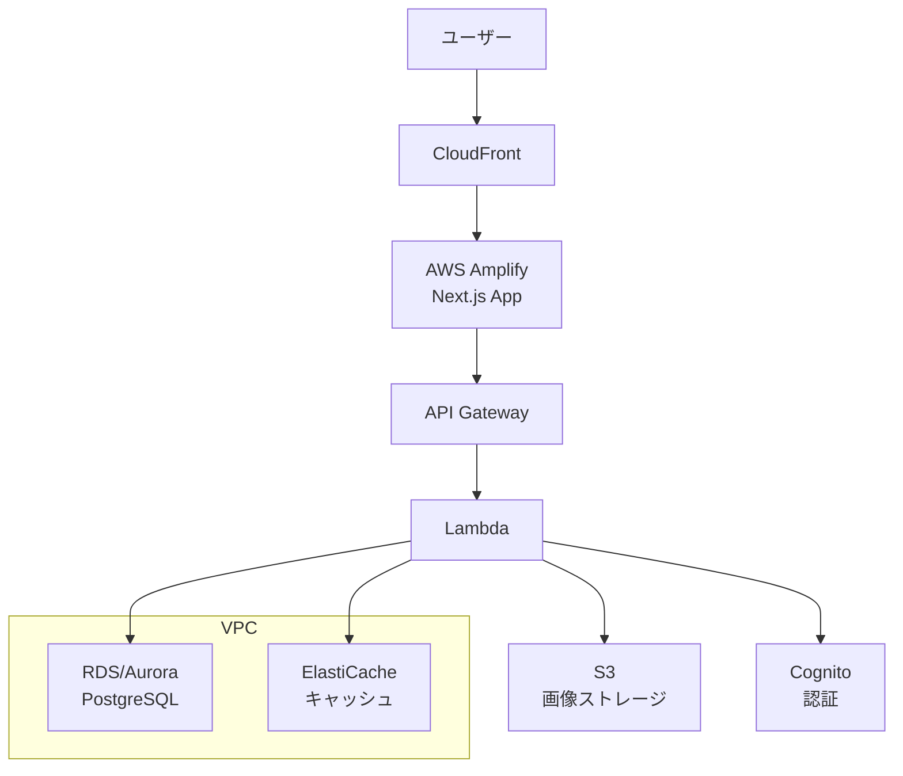

# AWSへの移行計画

## 1. 現在の構成
現在のアプリケーションは以下の構成で運用されています：
- フロントエンド/バックエンド: Vercelでホスティング
- データベース: Supabase
- 認証: Supabaseの認証機能
- ストレージ: Supabaseのストレージ

## 2. AWS移行後の構成

### 2.1 主要なAWSサービスの対応
| 現在のサービス | AWS移行後 | 主な機能 |
|------------|----------|---------|
| Vercel | AWS Amplify | - Next.jsアプリケーションのホスティング - CI/CD パイプライン - SSR/SSGサポート |
| Supabase (DB) | Amazon RDS/Aurora | - PostgreSQLデータベース - 自動バックアップ - スケーリング機能 |
| Supabase (認証) | Amazon Cognito | - ユーザー認証・認可 - ソーシャルログイン連携 - JWTトークン管理 |
| Supabase (ストレージ) | Amazon S3 | - 画像ファイルの保存 - CloudFrontと連携した配信 |

### 2.2 追加的なAWSサービス
1. API層
   - API Gateway
     - RESTful API管理
     - WebSocket API対応
     - リクエスト制限機能

2. サーバーレス機能
   - AWS Lambda
     - 画像分析処理
     - バッチ処理
     - イベント駆動処理

3. キャッシュ層
   - Amazon ElastiCache
     - セッション管理
     - クエリキャッシュ
     - 高速データアクセス

4. CDN
   - Amazon CloudFront
     - グローバルコンテンツ配信
     - エッジロケーション活用
     - SSL/TLS対応

### 2.3 アーキテクチャ構成図

## 3. 移行計画

### 3.1 フェーズ1: 準備段階
1. AWS環境のセットアップ
   - VPC設定
   - IAMユーザー・ロールの設定
   - 必要なサービスの有効化

2. データベース移行準備
   - スキーマ設計の見直し
   - テストデータでの移行テスト
   - パフォーマンステスト

### 3.2 フェーズ2: アプリケーション移行
1. Amplifyへのデプロイ設定
   - CI/CD パイプラインの構築
   - ビルド設定の最適化

2. 認証システムの移行
   - Cognitoの設定
   - ユーザーデータの移行
   - 認証フローのテスト

### 3.3 フェーズ3: データ移行
1. データベース移行
   - 本番データのエクスポート
   - RDS/Auroraへのインポート
   - 整合性チェック

2. ストレージ移行
   - S3バケットの設定
   - ファイルデータの移行
   - アクセス権限の設定

### 3.4 フェーズ4: 切り替えと検証
1. ドメイン切り替え
   - DNS設定の変更
   - SSL/TLS証明書の設定

2. 監視体制の構築
   - CloudWatchアラームの設定
   - ログ収集の設定
   - パフォーマンスモニタリング

## 4. 注意点と最適化

### 4.1 コスト最適化
- リソースの適切なサイジング
- 自動スケーリングの設定
- 予約インスタンスの検討
- コスト監視とアラートの設定

### 4.2 セキュリティ対策
- IAMロールの最小権限原則適用
- VPCでのネットワーク分離
- WAFによるWebアプリケーション保護
- セキュリティグループの適切な設定

### 4.3 パフォーマンス最適化
- RDSのRead Replicaの活用
- ElastiCacheによるキャッシュ層の実装
- CloudFrontのエッジロケーション活用
- Auto Scalingの適切な設定

### 4.4 運用管理
- CloudWatchでのモニタリング体制
- AWS Backupによるバックアップ戦略
- Systems Managerによる構成管理
- 定期的なメンテナンス計画

## 5. 予想される課題と対策

### 5.1 技術的課題
1. データ整合性の確保
   - 対策: 詳細なテストケースの作成
   - 移行前後のデータ検証プロセスの確立

2. ダウンタイムの最小化
   - 対策: ブルー/グリーンデプロイメント
   - 段階的な移行プロセス

### 5.2 運用面の課題
1. 運用チームのスキル
   - 対策: AWS認定資格の取得
   - 運用手順書の整備

2. コスト管理
   - 対策: 詳細なコスト分析
   - 予算アラートの設定 