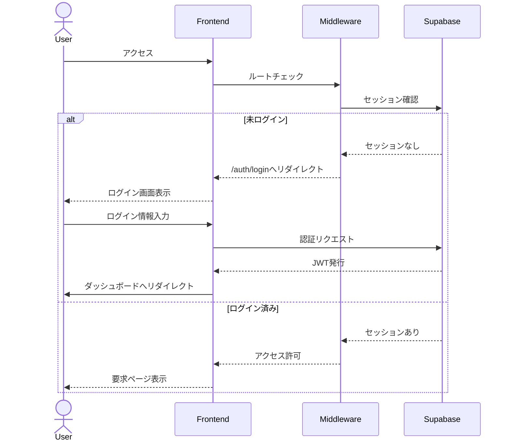
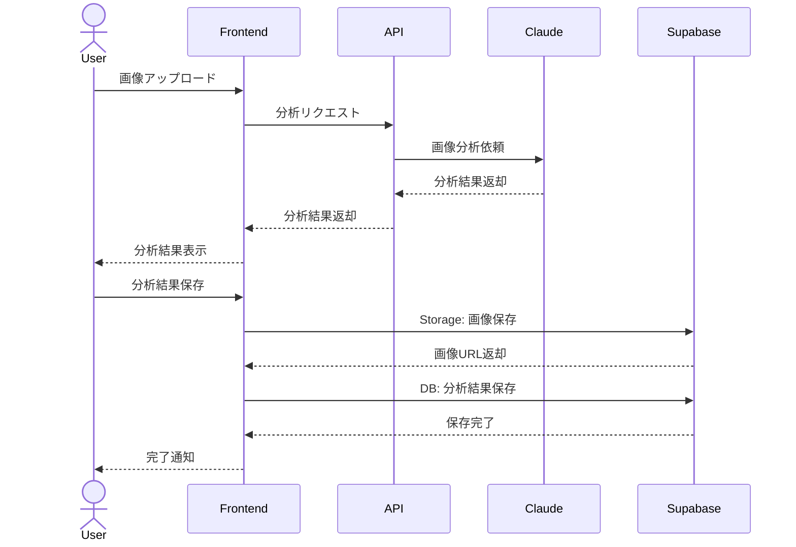
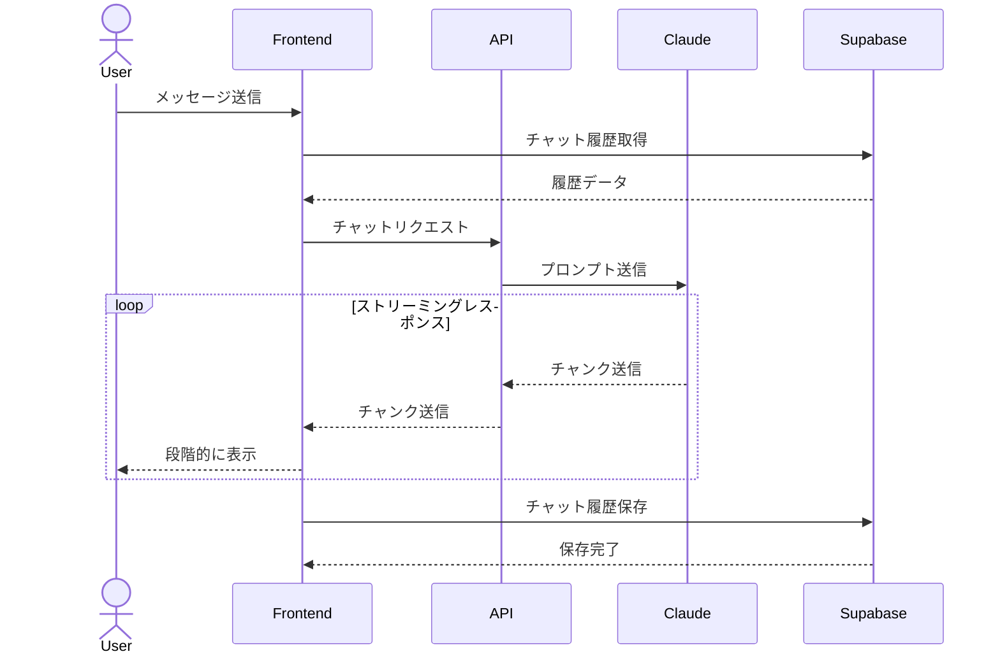
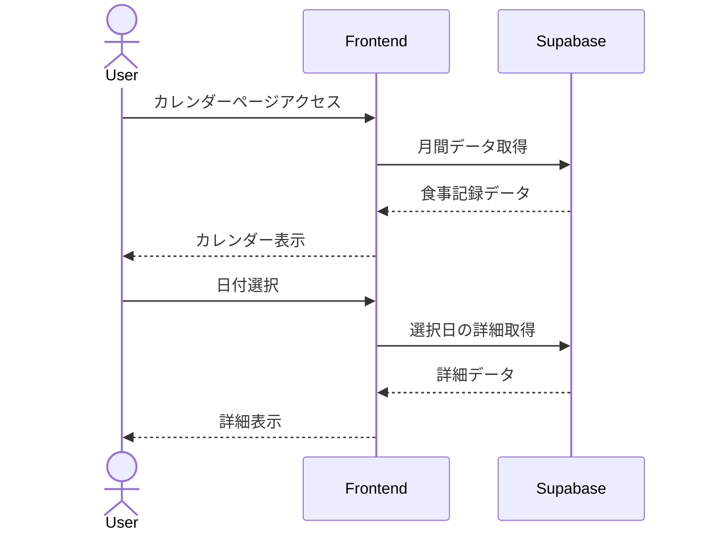
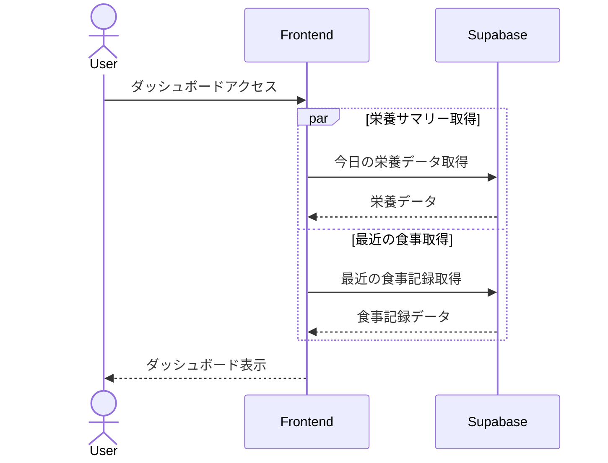

# アプリケーションシーケンス図

## 認証フロー

```mermaid
sequenceDiagram
    actor User
    participant Frontend
    participant Middleware
    participant Supabase
    
    User->>Frontend: アクセス
    Frontend->>Middleware: ルートチェック
    Middleware->>Supabase: セッション確認
    
    alt 未ログイン
        Supabase-->>Middleware: セッションなし
        Middleware-->>Frontend: /auth/loginへリダイレクト
        Frontend-->>User: ログイン画面表示
        User->>Frontend: ログイン情報入力
        Frontend->>Supabase: 認証リクエスト
        Supabase-->>Frontend: JWT発行
        Frontend->>User: ダッシュボードへリダイレクト
    else ログイン済み
        Supabase-->>Middleware: セッションあり
        Middleware-->>Frontend: アクセス許可
        Frontend-->>User: 要求ページ表示
    end
```

## 食事分析フロー

```mermaid
sequenceDiagram
    actor User
    participant Frontend
    participant API
    participant Claude
    participant Supabase
    
    User->>Frontend: 画像アップロード
    Frontend->>API: 分析リクエスト
    API->>Claude: 画像分析依頼
    Claude-->>API: 分析結果返却
    API-->>Frontend: 分析結果返却
    Frontend-->>User: 分析結果表示
    
    User->>Frontend: 分析結果保存
    Frontend->>Supabase: Storage: 画像保存
    Supabase-->>Frontend: 画像URL返却
    Frontend->>Supabase: DB: 分析結果保存
    Supabase-->>Frontend: 保存完了
    Frontend-->>User: 完了通知
```

## AIアシスタントチャットフロー

```mermaid
sequenceDiagram
    actor User
    participant Frontend
    participant API
    participant Claude
    participant Supabase
    
    User->>Frontend: メッセージ送信
    Frontend->>Supabase: チャット履歴取得
    Supabase-->>Frontend: 履歴データ
    Frontend->>API: チャットリクエスト
    API->>Claude: プロンプト送信
    
    loop ストリーミングレスポンス
        Claude-->>API: チャンク送信
        API-->>Frontend: チャンク送信
        Frontend-->>User: 段階的に表示
    end
    
    Frontend->>Supabase: チャット履歴保存
    Supabase-->>Frontend: 保存完了
```

## カレンダー表示フロー

```mermaid
sequenceDiagram
    actor User
    participant Frontend
    participant Supabase
    
    User->>Frontend: カレンダーページアクセス
    Frontend->>Supabase: 月間データ取得
    Supabase-->>Frontend: 食事記録データ
    Frontend-->>User: カレンダー表示
    
    User->>Frontend: 日付選択
    Frontend->>Supabase: 選択日の詳細取得
    Supabase-->>Frontend: 詳細データ
    Frontend-->>User: 詳細表示
```

## ダッシュボード表示フロー

```mermaid
sequenceDiagram
    actor User
    participant Frontend
    participant Supabase
    
    User->>Frontend: ダッシュボードアクセス
    par 栄養サマリー取得
        Frontend->>Supabase: 今日の栄養データ取得
        Supabase-->>Frontend: 栄養データ
    and 最近の食事取得
        Frontend->>Supabase: 最近の食事記録取得
        Supabase-->>Frontend: 食事記録データ
    end
    Frontend-->>User: ダッシュボード表示
``` 